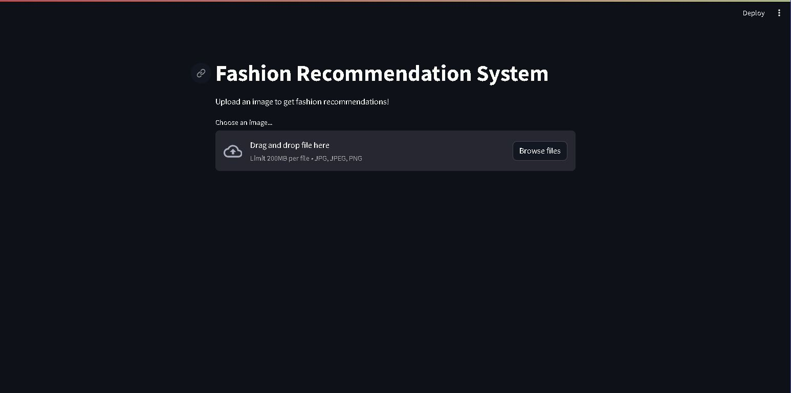

# Fashion Recommendation System

## Project Description

This project is a fashion recommendation system designed to suggest similar fashion products based on a user's uploaded image. The system leverages a pre-trained VGG16 model to extract features from the uploaded image and compare it to a dataset of fashion products to find the most similar items.

## Dataset

The dataset used in this project is the "Fashion Product Images (Small)" dataset from Kaggle. It contains information about various fashion products, including their images and style details.

### Downloading the Dataset

You can download the dataset from Kaggle using the following link: [Fashion Product Images (Small)](https://www.kaggle.com/datasets/paramaggarwal/fashion-product-images-small)

To download the dataset, follow these steps:

1. Go to the [Kaggle dataset page](https://www.kaggle.com/datasets/paramaggarwal/fashion-product-images-small).
2. Click on the "Download" button to download the dataset files.

The dataset contains a CSV file (`styles.csv`) with the following columns:
- `id`: Unique identifier for each product
- `gender`: Gender category of the product (e.g., Men, Women)
- `masterCategory`: Main category of the product (e.g., Apparel)
- `subCategory`: Sub-category of the product (e.g., Topwear)
- `articleType`: Specific type of article (e.g., T-Shirts)
- `baseColour`: Primary color of the product
- `season`: Season associated with the product
- `year`: Year the product was released
- `usage`: Usage category (e.g., Casual)
- `productDisplayName`: Display name of the product

The images corresponding to these products are named with their `id` followed by `.jpg`.

## File Structure

- `app.py`: Main application script that implements the recommendation system.
- `styles.csv`: Dataset file containing details about fashion products.
- `fashion-products-recommendation-system.ipynb`: Jupyter notebook containing additional analysis and code for the recommendation system.

## Requirements

To run this project, you need the following packages installed:

- numpy
- pandas
- tensorflow
- keras
- matplotlib
- cv2
- streamlit
- PIL
- joblib

You can install these packages using pip:

```bash
pip install numpy pandas tensorflow keras matplotlib opencv-python-headless streamlit pillow joblib
```

## Running the Project

1. **Prepare the Dataset:**

   Ensure that `styles.csv` is located in the root directory of the project. Also, ensure that the images are stored in a directory named `fashion_small/images/`.

2. **Run the Streamlit Application:**

   Execute the following command to start the Streamlit application:

   ```bash
   streamlit run app.py
   ```

3. **Upload an Image:**

   Open the Streamlit application in your web browser. You will be prompted to upload an image. Choose a fashion product image (in jpg, jpeg, or png format).

4. **View Recommendations:**

   Once the image is uploaded, the system will process the image and display the top 5 recommended images that are similar to the uploaded image.

## Code Overview

### app.py

This script contains the main logic for the recommendation system. It defines a `fashion_recommendations` class that includes methods for loading the model, processing the image, calculating similarity, and generating recommendations. The `main` function sets up the Streamlit interface for uploading an image and displaying the recommendations.

### Helper Functions

- `get_styles_df`: Loads the dataset and prepares it by adding an `image` column.
- `load_model`: Loads a pre-trained VGG16 model with ImageNet weights and prepares it for feature extraction.
- `predict`: Preprocesses the input image and uses the model to extract features.
- `get_similarity`: Calculates similarity between the input image features and the dataset features.
- `normalize_sim`: Normalizes the similarity scores.
- `get_recommendations`: Retrieves the top 5 most similar products based on similarity scores.
- `print_recommendations`: Saves and displays the recommended images.

### Preprocess Image

- `preprocess_image`: Preprocesses the uploaded image to the required format for the model.

### Main Function

- `main`: Sets up the Streamlit interface, handles file upload, and displays recommendations.

## Conclusion

This fashion recommendation system provides a simple yet effective way to find similar fashion products based on an uploaded image. By leveraging a pre-trained VGG16 model and a dataset of fashion products, the system can help users discover new fashion items that match their preferences.

## Sample of webpage


